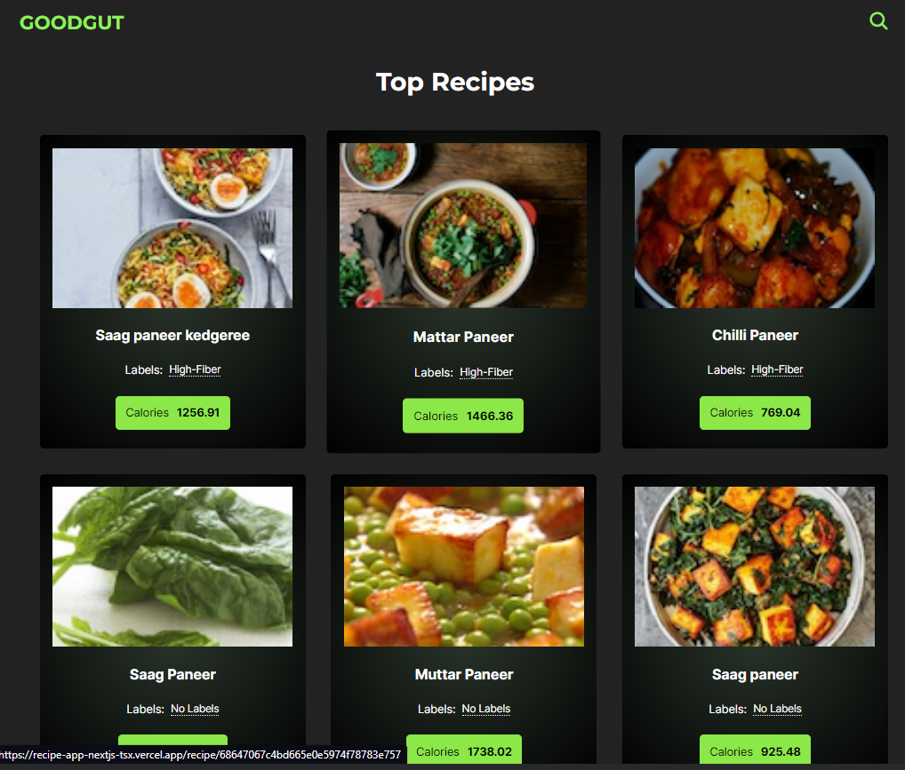
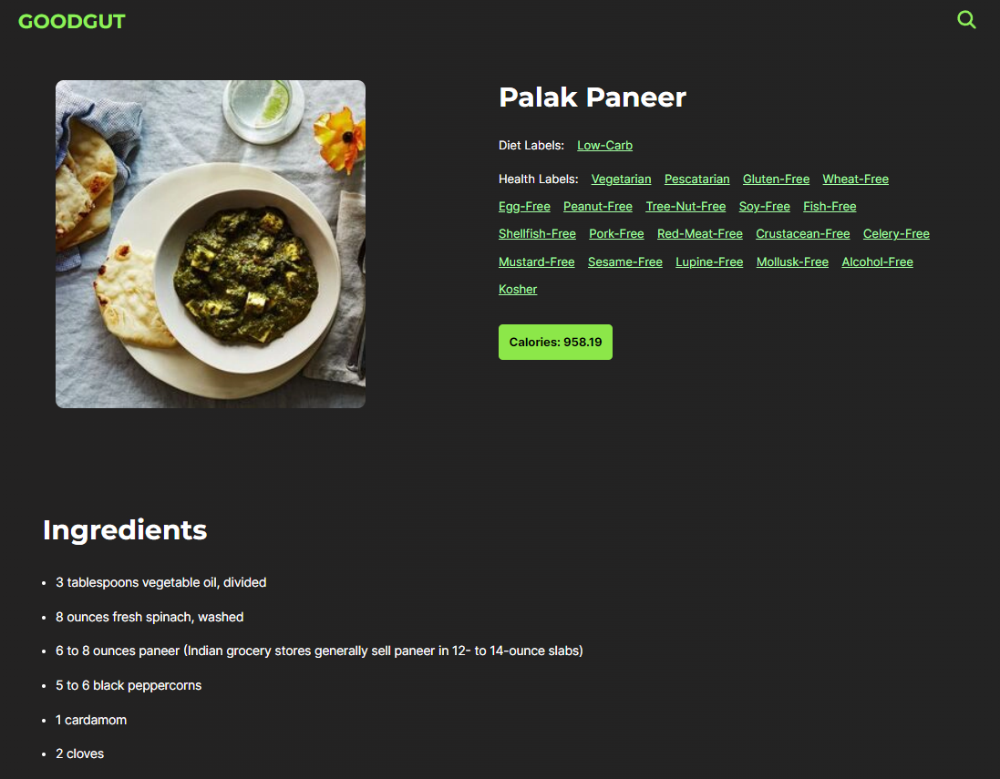

# Recipe App in Next.js

## Libraries & Tech Used

- Framework :- Next.js
- IDE :- Neovim
- Heroicons :- for icons
- Edaman Recipe Search Api :- to fetch recipes
- Redux Toolkit :- State Management
- Typescript :- for type checking

## How to run locally

1. First clone for fork the repository, then in root folder install all the necessary packages using the command `npm install`.

2. Run the server using `npm run dev`.

### View the Live Site Here <ins>_[Live Site](https://recipe-app-nextjs-tsx.vercel.app/)_</ins>

### Recipe App in Next.JS 

### Home Page

### Recipe Page

